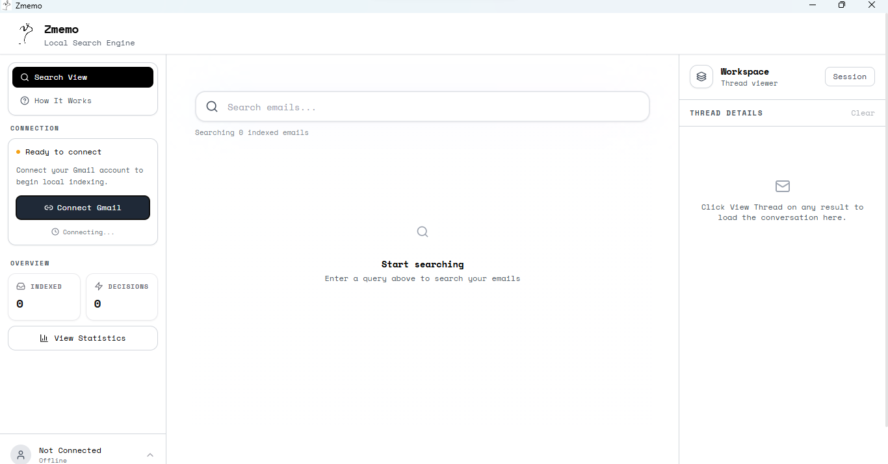

# Zmemo - Local-First Gmail Search



Zmemo is a desktop app that builds a private, local search index for your Gmail so you can find important emails in milliseconds. It runs fully on-device with a Tauri + React UI and a FastAPI backend backed by SQLite FTS5.

## Key Features

- Local-first indexing and search (no third-party cloud processing)
- Fast full-text search with highlighted snippets
- Background sync with Gmail History API plus auto-sync scheduling
- Decision email detection (approvals, confirmations, agreements)
- Thread view with open-in-Gmail shortcuts
- Filters for sender, domain, date range, attachments, and decision-only
- Lightweight local semantic re-ranking once the embedder is fitted

## Architecture

```
Tauri Desktop Shell
  -> React Frontend (Vite + Tailwind + shadcn/ui)
  -> FastAPI Backend (Python)
  -> SQLite + FTS5 (local storage)
```

## Documentation

- Quick Start: `QUICKSTART.md`
- Setup Guide: `SETUP.md`
- User Guide: `ZMEMO_USER_GUIDE.md`
- Roadmap: `ROADMAP.md`
- Code of Conduct: `CODE_OF_CONDUCT.md`

## Getting Started (Development)

### Prerequisites

- Node.js 18+
- Python 3.10+
- Rust (latest stable)
- Gmail API OAuth credentials (desktop app)

### 1. Google OAuth credentials

Create a Google Cloud project, enable Gmail API, and download `credentials.json`.

For development, place the file in the repo root or export `GM_CREDENTIALS_PATH`:

```bash
# Option A: repo root
./credentials.json

# Option B: env var
export GM_CREDENTIALS_PATH=/path/to/credentials.json
```

### 2. Backend setup

```bash
cd backend
python -m venv venv
# Windows: venv\Scripts\activate
# macOS/Linux: source venv/bin/activate
pip install -r requirements.txt
```

### 3. Frontend setup

```bash
cd frontend
npm install
```

### 4. Run the app

```bash
# Terminal 1: backend
cd backend
# Windows: venv\Scripts\activate
# macOS/Linux: source venv/bin/activate
python -m uvicorn main:app --reload --host 127.0.0.1 --port 8765

# Terminal 2: Tauri app
cd frontend
npm run tauri dev
```

Optional Windows helper:

```powershell
./run_backend.ps1
```

## Configuration

Environment variables:

- `GM_APP_DATA` sets the local data directory
- `GM_CREDENTIALS_PATH` overrides the location of `credentials.json`

Packaged builds bundle credentials in `resources/credentials.json` and copy them into the app data directory on first run.

## Data Storage

By default, the backend stores data in `~/.gmail-memory/` unless `GM_APP_DATA` is set. Packaged builds use the Tauri app data directory.

Key files:

- `emails.db` - SQLite database with FTS5 index
- `token.pickle` - Gmail OAuth token
- `credentials.json` - OAuth client credentials

## Project Layout

```
backend/               # FastAPI app + indexing + search
frontend/              # React UI
  src-tauri/           # Tauri shell
resources/credentials.json
```

## Contributing

Use GitHub Issues for bugs and feature requests. See `CODE_OF_CONDUCT.md` before contributing.

Issues: https://github.com/3lvin-Kc/Zmemo.opensource/issues

## License

MIT
